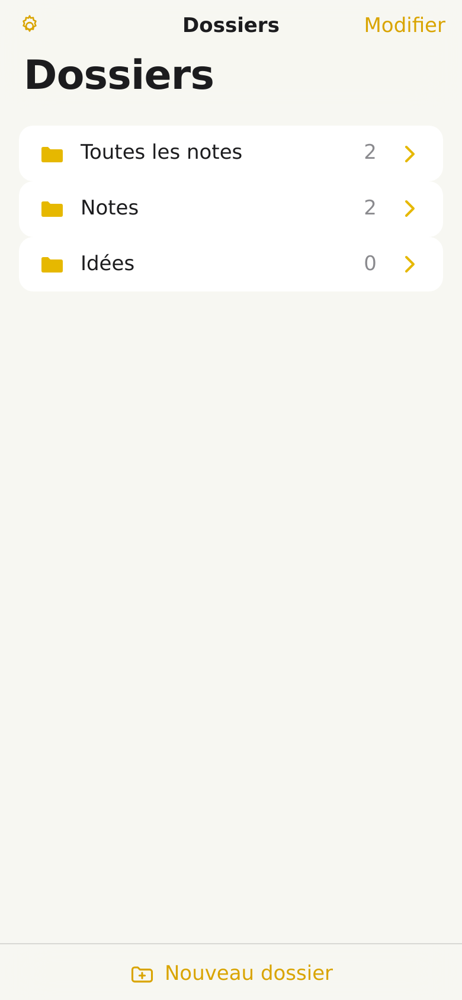
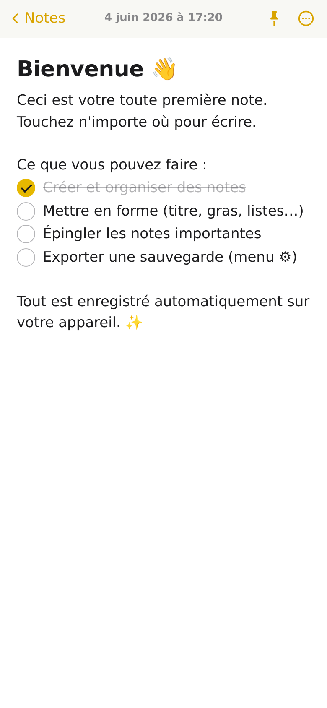
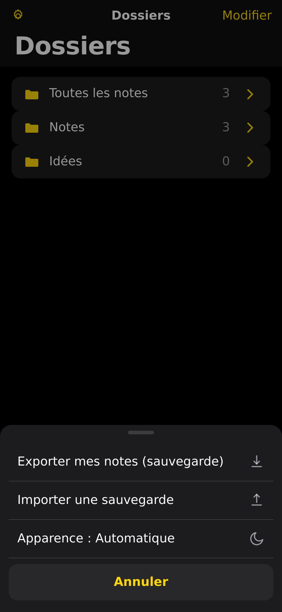

# 📝 Notes

Une application de prise de notes **moderne, interactive et pensée pour l'iPhone**,
inspirée de l'application *Notes* d'iOS. C'est une **PWA** (Progressive Web App) :
aucune installation depuis un store, elle s'ajoute directement à l'écran d'accueil
et fonctionne **hors-ligne**.

> Le tout en HTML / CSS / JavaScript **sans aucune dépendance** ni étape de build :
> le projet est versionné sur GitHub et se déploie en un clic sur GitHub Pages.

|  Dossiers (clair)  |  Éditeur enrichi  |  Mode sombre + sauvegarde  |
| :---: | :---: | :---: |
|  |  |  |

---

## ✨ Fonctionnalités

- **Design iOS authentique** : typographie système (SF), grands titres, barres
  translucides (effet *blur*), couleur jaune « Notes », animations de transition fluides.
- **Compatible tous iPhone** : mise en page *responsive* de l'iPhone SE au Pro Max,
  gestion des *safe areas* (encoche / barre d'accueil) via `env(safe-area-inset-*)`.
- **Organisation par dossiers** : « Toutes les notes », dossiers par défaut et
  dossiers personnalisés (création, renommage, suppression).
- **Éditeur enrichi** : titres et sous-titres, **gras**, *italique*, souligné, barré,
  listes à puces / numérotées et **listes à cocher** interactives.
- **Notes épinglées**, **recherche** instantanée (insensible aux accents), et
  **balayage** d'une note vers la gauche pour l'épingler ou la supprimer.
- **Sauvegarde automatique** : tout est enregistré en local (aucun compte requis).
- **Export / Import** d'une sauvegarde `.json` (votre vraie sauvegarde de secours).
- **Mode clair / sombre** : automatique (suit le système) ou forcé.
- **Hors-ligne** grâce à un *service worker*, **installable** sur l'écran d'accueil.

---

## 🚀 Utilisation

### En local (essai rapide)

L'app étant 100 % statique, il suffit de la servir avec n'importe quel serveur HTTP :

```bash
# avec Python (déjà présent sur macOS / Linux)
python3 -m http.server 8137
# puis ouvrez http://localhost:8137 dans le navigateur
```

> Astuce : ouvrir `index.html` directement (en `file://`) fonctionne aussi pour la
> plupart des fonctions, mais le *service worker* (hors-ligne) nécessite `http(s)://`.

### Sur iPhone (installation)

1. Ouvrez l'URL de l'application dans **Safari**.
2. Touchez le bouton **Partager** puis **« Sur l'écran d'accueil »**.
3. L'app s'ouvre en plein écran, comme une application native. 🎉

---

## ☁️ Déploiement sur GitHub Pages

Un workflow GitHub Actions est déjà fourni (`.github/workflows/deploy.yml`).
Pour publier l'application :

1. Dans le dépôt GitHub : **Settings → Pages**.
2. **Source** : choisissez **GitHub Actions**.
3. Fusionnez ce travail sur la branche `main` (ou lancez le workflow manuellement
   via l'onglet **Actions → Deploy to GitHub Pages → Run workflow**).

L'application sera alors disponible à une adresse du type
`https://<utilisateur>.github.io/agathe/` — à ouvrir sur iPhone puis ajouter à
l'écran d'accueil.

---

## 💾 Sauvegarde : 3 niveaux

1. **Locale automatique** : chaque modification est enregistrée sur l'appareil,
   avec une **copie de secours** et une **restauration automatique** en cas de souci.
2. **Synchro entre appareils (via GitHub, fiable)** : tes notes sont synchronisées
   automatiquement **dans les 2 sens** via un **dépôt GitHub privé**. Active-la
   dans **⚙︎ → Synchro entre appareils** (voir ci-dessous).
3. **Export manuel** : à tout moment, **⚙︎ → Exporter mes notes** produit un
   fichier `.json` à conserver ou réimporter ailleurs.

### ☁️ Activer la synchro entre appareils (via GitHub)

1. Crée un **code GitHub** (jeton) : GitHub → *Settings → Developer settings →
   Personal access tokens → Tokens (classic)* → coche **gist** → génère-le (`ghp_…`).
2. Sur le **1er appareil** : **⚙︎ → Synchro entre appareils**, colle le code GitHub
   puis **Activer la synchro**. L'app crée un **Gist privé** (ta sauvegarde) et
   affiche un **code de synchro** (à copier).
3. Sur les **autres appareils** : **⚙︎ → Synchro entre appareils**, colle le
   **code de synchro** dans *« J'ai déjà un code »* puis **Rejoindre** (pas besoin de
   recréer un jeton).
4. Ensuite, **tout se synchronise automatiquement dans les 2 sens**. Le badge
   **« ☁ Synchronisé »** confirme l'état.

> 🔒 **Sécurité** : le code GitHub reste **uniquement sur tes appareils** (jamais
> dans le dépôt public de l'app). Le Gist de sauvegarde est **secret/privé** : comme
> tes notes peuvent contenir des mots de passe, ne le rends jamais public. La fusion est
> « intelligente » (la note la plus récente gagne) pour ne rien perdre entre
> appareils. La copie locale + l'export `.json` restent des sauvegardes garanties.
>
> ℹ️ *Pourquoi GitHub ?* C'est la méthode **fiable** : l'API GitHub fonctionne
> depuis n'importe quel navigateur. Les relais « sans compte » testés se sont
> révélés bloqués/indisponibles côté navigateur.

---

## 🗂️ Structure du projet

```
.
├── index.html              # Structure de l'application (3 écrans : dossiers, notes, éditeur)
├── styles.css              # Thème iOS, mode clair/sombre, responsive, safe areas
├── app.js                  # Toute la logique (navigation, éditeur, stockage, recherche…)
├── manifest.webmanifest    # Métadonnées PWA (installation)
├── service-worker.js       # Cache hors-ligne
├── icons/                  # Icônes de l'app (SVG + PNG générés)
├── tools/generate-icons.py # Génère les PNG d'icônes (pur Python, sans dépendance)
└── .github/workflows/      # Déploiement GitHub Pages
```

### Régénérer les icônes

```bash
python3 tools/generate-icons.py
```

---

## 🧪 Qualité

L'application a été testée dans un navigateur **Chromium headless** aux dimensions
d'un iPhone (390×844) : navigation, création/édition/sauvegarde de notes, listes à
cocher, recherche, balayage tactile, mode sombre et menus — **sans aucune erreur
console**.

---

## 🧾 Versions

Le numéro de version est affiché **tout en haut** de l'écran *Dossiers* et est mis à
jour à chaque évolution.

- **v1.3.3**
  - Synchro GitHub via **Gist** (au lieu d'un dépôt) : ne demande qu'une seule
    permission **`gist`** sur le jeton (plus simple, pas de création de dépôt).
- **v1.3.2**
  - Synchro entre appareils repassée sur **GitHub** (méthode fiable) : les relais
    « sans compte » se sont révélés bloqués/indisponibles côté navigateur. On garde
    la même UX « code » (activer → code à coller sur les autres appareils), mais le
    « code » embarque le jeton GitHub + le dépôt privé.
- **v1.3.1**
  - (Tentative) Relais de synchro sans compte via requêtes simples — abandonné en
    v1.3.2 car non fiable côté navigateur.
- **v1.3.0**
  - **Synchro entre appareils par « Code de synchro »**, **sans jeton ni compte** :
    un code à activer sur un appareil et à coller sur les autres. Synchro
    automatique **dans les 2 sens**.
  - **Chiffrement de bout en bout** (AES-GCM 256) : les notes sont chiffrées sur
    l'appareil ; la clé vit dans le code et n'est jamais envoyée au relais.
  - Remplace la synchro « jeton GitHub » de la v1.2.0 (plus de jeton à gérer).
  - Identifiants des notes d'exemple fixés (évite les doublons à la fusion).
- **v1.2.0**
  - **Sauvegarde « cloud » sur GitHub** (remplacée en v1.3.0) : dépôt GitHub privé
    via un jeton d'accès, synchronisée entre appareils (fusion intelligente).
  - Connexion en un écran (⚙︎ → *Sauvegarde GitHub*) : jeton + nom du dépôt
    (créé en privé automatiquement). Le **jeton reste sur l'appareil**.
  - Badge **« ☁ Synchronisé »** en haut, envoi auto à chaque modification,
    récupération à l'ouverture et au retour sur l'app, gestion des conflits.
- **v1.1.0**
  - Numéro de version affiché dans l'application (et mis à jour à chaque MAJ).
  - **Sauvegarde automatique renforcée** : copie de secours redondante en local et
    **restauration automatique** si la donnée principale est perdue/corrompue.
  - Indicateur **« ✓ Enregistré »** dans l'éditeur.
  - Déploiement GitHub Pages automatique (auto-activation de Pages) et fusion sur `main`.
- **v1.0.0**
  - Première version : app Notes façon iOS (dossiers, éditeur enrichi, listes à
    cocher, recherche, épinglage, balayage, mode clair/sombre, export/import, PWA).

---

## 🛣️ Évolutions possibles

- Verrouillage de notes (Face ID / mot de passe), pièces jointes, partage.
- Étiquettes, tri personnalisé, corbeille avec restauration (avec tombstones pour
  propager les suppressions entre appareils).

---

Fait avec ❤️ — sans framework, sans build, juste du web standard.
